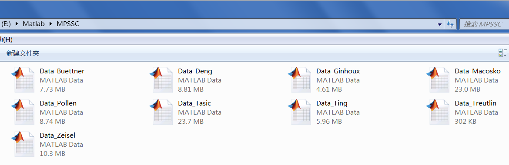

# Download URL:  
the whole MPSSC dataset can be downloaded from the URL:  
https://github.com/ishspsy/project/tree/master/MPSSC/Data `[93.3mb]`

# Data sources:  

Data_Buettner.mat refers to https://www.ncbi.nlm.nih.gov/pubmed/25599176.  
Data_Deng.mat refers to http://science.sciencemag.org/content/343/6167/193.  
Data_Ginhoux.mat refers to https://www.ncbi.nlm.nih.gov/pubmed/26054720.  
Data_Macosko.mat refers to https://www.ncbi.nlm.nih.gov/pubmed/26000488.  
Data_Pollen.mat refers to https://www.nature.com/articles/nbt.2967.  
Data_Tasic.mat refers to https://www.ncbi.nlm.nih.gov/pubmed/26727548.  
Data_Ting.mat refers to https://www.ncbi.nlm.nih.gov/pubmed/25242334.  
Data_Treutlin.mat refers to https://www.ncbi.nlm.nih.gov/pubmed/24739965.  
Data_Zeisel.mat refers to https://www.ncbi.nlm.nih.gov/pubmed/25700174.  

# File operations:  

`do not rename` these mat files, then `move` the MPSSC folder to the working directory  

