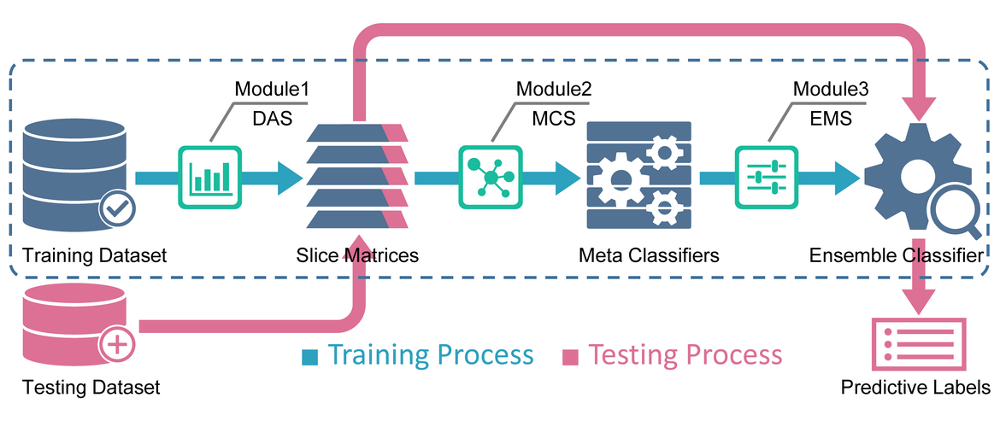
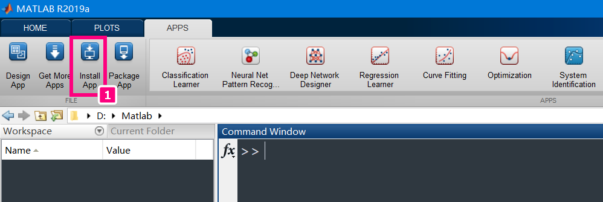
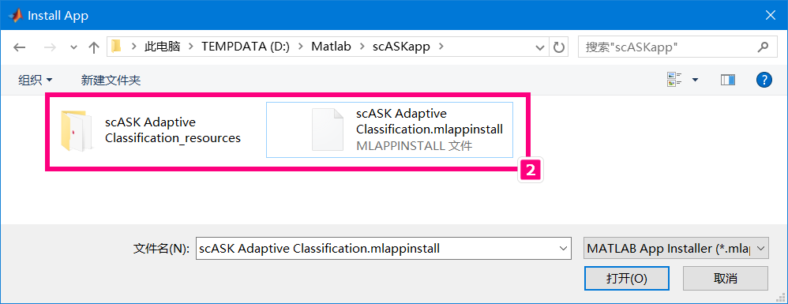
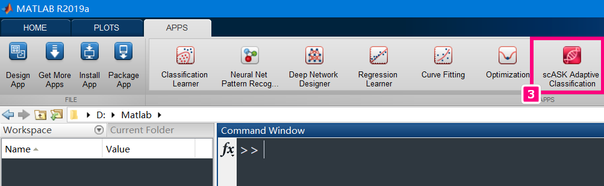

# scASKapp v1.0
The graphical user interface version of the scASK.  Availability: https://github.com/liubo2358/scASKapp  
*Note:* In present period, the source code of scASKapp is open only to collaborators. Please contact the corresponding author (xfzou AT whu.edu.cn) if you have further questions about scASKapp.

# Introduction

The scASK is a novel and robust ensemble framework that is especially suited for cell type classification based on scRNA-seq data. Furthermore, scASK is also a generic ensemble classifier for any supervised classification problem, such as classifying cancer types based on gene expression data or DNA methylation data. scASKapp is the GUI version of scASK with the App Designer technique, which can significantly simplify the analysis process and parameters selection, and has the ability of applying known labels from raw dataset to new dataset.  
  

# Example datasets

1. `SIMLR dataset` https://github.com/BatzoglouLabSU/SIMLR/tree/SIMLR/MATLAB/data `[77.4mb]`
2. `MPSSC dataset` https://github.com/ishspsy/project/tree/master/MPSSC/Data `[93.3mb]`

# Quick guide for installing scASKapp

Step1: Click `Install App` button on the APPS tab of Matlab 2019a (or later releases)
  

Step2: Select and open `scASK Adaptive Classification.mlappinstall` file  
  

Step3: Then click the `icon of scASKapp` that appears in the toolstrip,  scASK will be launching soon   
  

# Supplementary materials

1. The complete running parameters and screenshots for Pollen example dataset can be found in [`Supplementary.pdf`](./Supplementary/Supplementary.pdf "Supplementary.pdf") `[1.98mb]`
2. The dynamic demonstration for implementing cell type classification using scASKapp can be found in [`Demonstration.wmv`](./Supplementary/Demonstration.wmv "Demonstration.wmv") `[10.2mb]`

# Author's remarks

1. scASKapp is developed with Matlab 2019a and compatible with later releases
2. dataset should be ready before running the scASKapp
3. the command line version of the scASK is publicly available at https://github.com/liubo2358/scASKcmd
