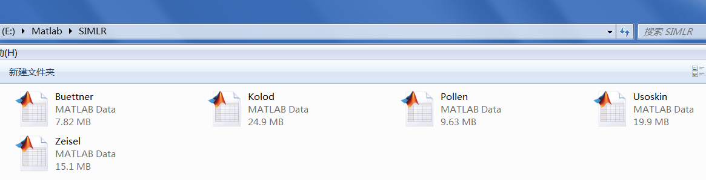

# Download URL:  
the whole SIMLR dataset can be downloaded from the URL:  
https://github.com/BatzoglouLabSU/SIMLR/tree/SIMLR/MATLAB/data `[77.4mb]`

# Data sources:  

Test_1_mECS.mat refers to http://www.ncbi.nlm.nih.gov/pubmed/25599176.  
Test_2_Kolod.mat refers to http://www.ncbi.nlm.nih.gov/pmc/articles/PMC4595712.   
Test_3_Pollen.mat refers to http://www.ncbi.nlm.nih.gov/pubmed/25086649.  
Test_4_Usoskin.mat refers to http://www.ncbi.nlm.nih.gov/pubmed/25420068.  
Test_5_Zeisel.mat refers to https://www.ncbi.nlm.nih.gov/pubmed/25700174.  

# File operations:

`rename` Test_1_mECS.mat as Buettner.mat, `rename` Test_2_Kolod.mat as Kolod.mat, `rename` Test_3_Pollen.mat as Pollen.mat, `rename` Test_4_Usoskin.mat as Usoskin.mat, `rename` Test_5_Zeisel.mat as Zeisel.mat, then `move` the SIMLR folder to the working directory

